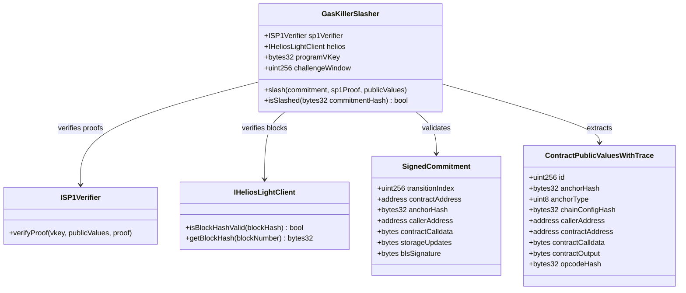
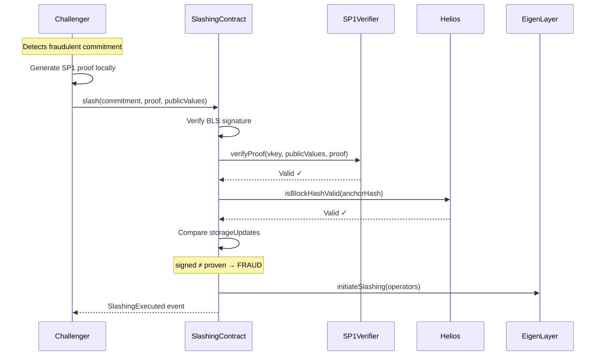
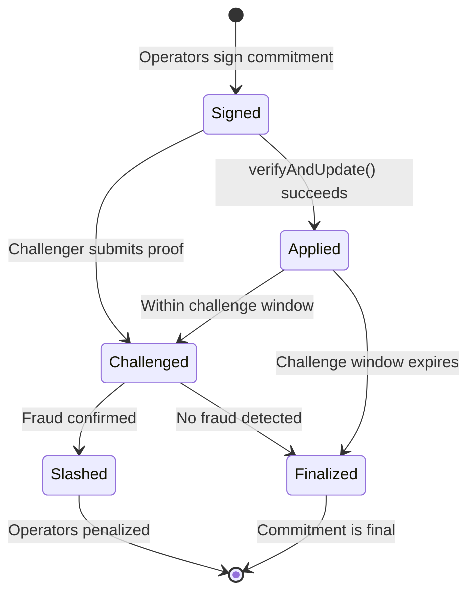
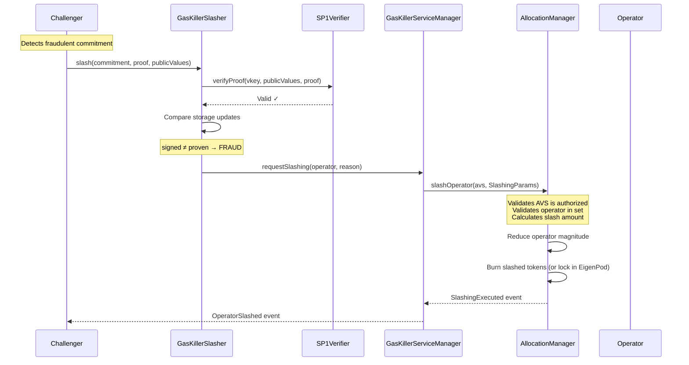

# Technical Spec: Gas Killer On-Chain Slashing

## 1. Background

### Problem Statement

The Gas Killer aggregate network signs storage updates for contract state transitions, but there is currently no mechanism to penalize operators who sign incorrect storage updates. Without slashing, malicious or faulty operators can sign fraudulent state transitions without consequence, undermining the security guarantees of the system.

### Context / History

- **Gas Killer SDK**: Implements `verifyAndUpdate()` for applying signed storage updates
- **EigenLayer Integration**: Uses BLS signature verification with 66% quorum threshold
- **SP1 Contract Call**: Provides zkVM execution proofs for EVM contract calls
- **Opcode Hash Feature**: Commits to state-modifying opcodes (SSTORE, CALL, LOG0-LOG4) in proofs
- **Current Gap**: The signed message lacks sufficient data for reproducible execution verification

**Relevant Links:**
- [GasKillerSDK.sol](https://github.com/BreadchainCoop/gas-killer-solidity-sdk/blob/main/src/GasKillerSDK.sol)
- [SP1 Contract Call](https://github.com/succinctlabs/sp1-contract-call)
- [Helios Light Client](https://github.com/a16z/helios)

### Stakeholders

| Stakeholder | Role |
|-------------|------|
| Aggregate Network Operators | Sign storage updates, subject to slashing |
| Gas Killer SDK Users | Rely on correct state transitions |
| Challengers | Submit fraud proofs to slash malicious operators |
| EigenLayer | Provides restaking and slashing infrastructure |
| Helios/EIP-4788 | Block hash verification for state anchoring |

---

## 2. Motivation

### Goals & Success Stories

**Goal 1: Enable Fraud Detection**
> As a challenger, I can prove that the aggregate network signed incorrect storage updates by generating an SP1 proof of the correct execution and comparing results.

**Goal 2: Cryptoeconomic Security**
> As a Gas Killer user, I can trust that operators have economic stake at risk, ensuring they are incentivized to sign correct updates.

**Goal 3: Deterministic Verification**
> As a slashing contract, I can verify that given the same inputs (block, caller, calldata), the signed storage updates do not match the proven execution.

**Goal 4: Minimal Protocol Changes**
> As a developer, I can integrate slashing by modifying only the signed message format, without changing the core execution flow.

---

## 3. Scope and Approaches

### Non-Goals

| Technical Functionality | Reasoning for being off scope | Tradeoffs |
|------------------------|------------------------------|-----------|
| Real-time slashing | Requires complex dispute game | Delayed slashing is acceptable for economic security |
| Slashing for liveness failures | Out of scope for this spec | Focus on correctness, not availability |
| Cross-chain slashing | Adds complexity | Single-chain slashing first |
| Automatic challenger rewards | Incentive design is separate | Manual reward distribution initially |

### Value Proposition

| Technical Functionality | Value | Tradeoffs |
|------------------------|-------|-----------|
| SP1 Proof Verification | Cryptographic guarantee of correct execution | ~300k gas per verification |
| Helios Block Verification | Proves execution against real Ethereum state | ~200k gas, requires light client sync |
| EIP-4788 Alternative | Cheaper block verification for recent blocks | Only works for last ~27 hours |
| Derived Opcode Hash | Execution fingerprint from storage updates | Implicit in storage structure |

### Alternative Approaches

| Approach | Pros | Cons |
|----------|------|------|
| **SP1 zkVM Proofs (Chosen)** | Cryptographic soundness, supports any EVM execution | Higher gas cost, proof generation time |
| **Optimistic Fraud Proofs** | Lower gas in happy path | Longer dispute windows, complex bisection |
| **TEE Attestation** | Fast verification | Trust in hardware, not cryptographic |
| **Re-execution by Committee** | Simple implementation | Requires trusted committee, not trustless |

### Relevant Metrics

- Slashing proof verification gas cost: ~500k gas (SP1 + Helios)
- Proof generation time: ~5 minutes (CPU), ~30 seconds (SP1 Network)
- Challenge window: Configurable (suggested: 7 days)
- Minimum slash amount: Configurable per operator stake

---

## 4. Step-by-Step Flow

### 4.1 Main ("Happy") Path: No Fraud

**Pre-condition:** Aggregate network has signed a valid storage update commitment

1. **Operator** signs storage update commitment:
   ```
   commitment = sha256(transitionIndex, contract, anchorHash, caller, calldata, storageUpdates)
   ```

2. **User** calls `verifyAndUpdate()` with BLS signature

3. **Contract** validates:
   - Block number is not stale (≤300 blocks)
   - Transition index is sequential
   - BLS signature has ≥66% quorum

4. **Contract** applies storage updates via `StateChangeHandlerLib`

**Post-condition:** State updated, no fraud detected, operators retain stake

---

### 4.2 Slashing Path: Fraud Detected

**Pre-condition:** Challenger believes signed storage updates are incorrect

1. **Challenger** retrieves the signed commitment from on-chain events

2. **Challenger** generates SP1 proof:
   - Fetches Ethereum state at `anchorHash` block
   - Executes `calldata` against `contract` from `caller`
   - Captures actual storage updates from execution
   - Generates PLONK proof with `ContractPublicValuesWithTrace`

3. **Challenger** calls `slash()` with:
   - Original signed commitment + BLS signature
   - SP1 proof + public values

4. **Slashing Contract** validates:
   - BLS signature is valid for the commitment
   - SP1 proof is valid
   - Anchor hash matches (via Helios or EIP-4788)
   - Inputs match (caller, contract, calldata)
   - Storage updates differ → **FRAUD CONFIRMED**

5. **Slashing Contract** executes penalty:
   - Emits `OperatorSlashed` event
   - Triggers EigenLayer slashing for signing operators

**Post-condition:** Malicious operators slashed, challenger optionally rewarded

---

### 4.3 Alternate / Error Paths

| # | Condition | System Action | Suggested Handling |
|---|-----------|---------------|-------------------|
| A1 | SP1 proof invalid | Revert with `InvalidProof` | Challenger must regenerate proof |
| A2 | Anchor hash not verified by Helios | Revert with `UnverifiedBlock` | Wait for Helios sync or use EIP-4788 |
| A3 | Inputs don't match commitment | Revert with `InputMismatch` | Challenger submitted wrong data |
| A4 | Storage updates match | Revert with `NoFraudDetected` | No slashing, commitment was correct |
| A5 | Challenge window expired | Revert with `ChallengeExpired` | Too late to challenge this transition |
| A6 | Operator already slashed | Revert with `AlreadySlashed` | Prevent double slashing |

---

## 5. UML Diagrams

### 5.1 Class Diagram



### 5.2 Sequence Diagram: Slashing Flow



### 5.3 State Diagram: Commitment Lifecycle



---

## 6. Technical Specification

### 6.1 Modified Signed Message Format

**Current (Insufficient):**
```solidity
sha256(abi.encode(transitionIndex, address(this), targetFunction, storageUpdates))
```

**Required (Slashable):**
```solidity
sha256(abi.encode(
    transitionIndex,      // uint256: Sequential counter
    contractAddress,      // address: Target contract
    anchorHash,           // bytes32: Block hash for state anchoring
    callerAddress,        // address: msg.sender for the call
    contractCalldata,     // bytes: Full calldata with arguments
    storageUpdates        // bytes: Claimed storage changes
))
```

### 6.2 Storage Updates Format

Storage updates are encoded as parallel arrays:
```solidity
struct StorageUpdate {
    bytes32 slot;   // Storage slot
    bytes32 value;  // New value
}

// Encoded as: abi.encode(StorageUpdate[])
```

**Deriving Opcode Hash from Storage Updates:**
Since each SSTORE corresponds to a storage update, the opcode sequence can be reconstructed:
```
opcodeHash = keccak256(concat(0x55 for each storage update, LOG opcodes from events))
```

### 6.3 Slashing Contract Interface

```solidity
// SPDX-License-Identifier: MIT
pragma solidity ^0.8.20;

import {ISP1Verifier} from "@sp1-contracts/ISP1Verifier.sol";

interface IGasKillerSlasher {
    struct SignedCommitment {
        uint256 transitionIndex;
        address contractAddress;
        bytes32 anchorHash;
        address callerAddress;
        bytes contractCalldata;
        bytes storageUpdates;
        bytes blsSignature;
        address[] signers;  // Operators who signed
    }

    event SlashingExecuted(
        bytes32 indexed commitmentHash,
        address indexed challenger,
        address[] slashedOperators,
        uint256 slashAmount
    );

    event ChallengeSubmitted(
        bytes32 indexed commitmentHash,
        address indexed challenger
    );

    /// @notice Submit a slashing proof
    /// @param commitment The original signed commitment
    /// @param sp1Proof The SP1 PLONK proof
    /// @param sp1PublicValues The SP1 public values (ContractPublicValuesWithTrace)
    function slash(
        SignedCommitment calldata commitment,
        bytes calldata sp1Proof,
        bytes calldata sp1PublicValues
    ) external;

    /// @notice Check if a commitment has been slashed
    function isSlashed(bytes32 commitmentHash) external view returns (bool);

    /// @notice Get the challenge window duration
    function challengeWindow() external view returns (uint256);
}
```

### 6.4 SP1 Public Values Decoding

```solidity
function decodePublicValues(bytes calldata publicValues)
    internal
    pure
    returns (
        bytes32 anchorHash,
        address callerAddress,
        address contractAddress,
        bytes memory contractCalldata,
        bytes memory contractOutput,
        bytes32 opcodeHash
    )
{
    // Skip first 32 bytes (offset for dynamic struct)
    // Then decode the ContractPublicValuesWithTrace struct
    (
        uint256 id,
        bytes32 _anchorHash,
        uint8 anchorType,
        bytes32 chainConfigHash,
        address _callerAddress,
        address _contractAddress,
        bytes memory _contractCalldata,
        bytes memory _contractOutput,
        bytes32 _opcodeHash
    ) = abi.decode(publicValues, (
        uint256, bytes32, uint8, bytes32, address, address, bytes, bytes, bytes32
    ));

    return (_anchorHash, _callerAddress, _contractAddress, _contractCalldata, _contractOutput, _opcodeHash);
}
```

### 6.5 Fraud Detection Logic

```solidity
function detectFraud(
    SignedCommitment calldata commitment,
    bytes calldata sp1PublicValues
) internal view returns (bool isFraud, string memory reason) {
    (
        bytes32 provenAnchor,
        address provenCaller,
        address provenContract,
        bytes memory provenCalldata,
        bytes memory provenOutput,
        bytes32 provenOpcodeHash
    ) = decodePublicValues(sp1PublicValues);

    // Verify inputs match
    if (provenAnchor != commitment.anchorHash) {
        return (false, "Anchor mismatch - invalid challenge");
    }
    if (provenCaller != commitment.callerAddress) {
        return (false, "Caller mismatch - invalid challenge");
    }
    if (provenContract != commitment.contractAddress) {
        return (false, "Contract mismatch - invalid challenge");
    }
    if (keccak256(provenCalldata) != keccak256(commitment.contractCalldata)) {
        return (false, "Calldata mismatch - invalid challenge");
    }

    // Extract storage updates from proven output
    bytes memory provenStorageUpdates = extractStorageUpdates(provenOutput);

    // Compare storage updates
    if (keccak256(provenStorageUpdates) != keccak256(commitment.storageUpdates)) {
        return (true, "Storage updates differ - FRAUD DETECTED");
    }

    return (false, "No fraud detected");
}
```

---

## 7. EigenLayer Integration

### 7.1 Overview

EigenLayer slashing went live on mainnet on April 17, 2025. Gas Killer must integrate with EigenLayer's slashing infrastructure to penalize operators who sign incorrect storage updates. The key integration points are:

- **AllocationManager**: Core contract that executes slashing
- **Operator Sets**: Grouping mechanism for operators within an AVS
- **Unique Stake**: Allocatable stake that can only be slashed once per commitment
- **ServiceManagerBase**: AVS contract that receives slashing callbacks

### 7.2 Core Contracts

```
┌─────────────────────────────────────────────────────────────────────┐
│                        EigenLayer Core                               │
├─────────────────────────────────────────────────────────────────────┤
│  AllocationManager                                                   │
│  ├── slashOperator(avs, SlashingParams)                             │
│  ├── modifyAllocations(operator, allocations)                       │
│  └── getAllocatedMagnitude(operator, strategy, operatorSet)         │
├─────────────────────────────────────────────────────────────────────┤
│  DelegationManager                                                   │
│  ├── getOperatorShares(operator, strategies)                        │
│  └── getWithdrawableShares(staker, strategies)                      │
├─────────────────────────────────────────────────────────────────────┤
│  StrategyManager                                                     │
│  └── strategies[] (LSTs, native ETH, etc.)                          │
└─────────────────────────────────────────────────────────────────────┘
```

### 7.3 Slashing Parameters

```solidity
/// @notice Struct for slashing an operator
struct SlashingParams {
    address operator;           // Operator to slash
    uint32 operatorSetId;       // Operator set within the AVS
    address[] strategies;       // Strategies to slash (e.g., stETH, rETH)
    uint256[] wadsToSlash;      // Slash amount per strategy (in WADs, 1e18 = 100%)
    string description;         // Human-readable reason for slashing
}

/// @notice Operator set identifier
struct OperatorSet {
    address avs;                // AVS address (Gas Killer ServiceManager)
    uint32 operatorSetId;       // Numeric ID for the operator set
}
```

### 7.4 Gas Killer AVS Configuration

The Gas Killer AVS must be configured with:

1. **Operator Set(s)**: At least one operator set for aggregate network operators
2. **Slashable Strategies**: Which staking strategies can be slashed
3. **Allocation Requirements**: Minimum stake allocation per operator

```solidity
// Example operator set configuration
struct GasKillerOperatorSet {
    uint32 id;                          // e.g., 1 for mainnet aggregate network
    uint256 minimumAllocationWad;       // e.g., 0.1e18 (10% of operator's stake)
    address[] requiredStrategies;       // e.g., [stETH, rETH, native ETH]
}
```

### 7.5 Slashing Flow with EigenLayer



### 7.6 ServiceManagerBase Implementation

The Gas Killer ServiceManager must implement EigenLayer's AVS interface:

```solidity
// SPDX-License-Identifier: MIT
pragma solidity ^0.8.20;

import {ServiceManagerBase} from "@eigenlayer-middleware/ServiceManagerBase.sol";
import {IAllocationManager} from "@eigenlayer/interfaces/IAllocationManager.sol";

contract GasKillerServiceManager is ServiceManagerBase {
    /// @notice The slashing contract authorized to request slashing
    address public slashingContract;

    /// @notice Operator set ID for aggregate network operators
    uint32 public constant AGGREGATE_OPERATOR_SET_ID = 1;

    /// @notice Default slash percentage (10% = 0.1e18)
    uint256 public constant DEFAULT_SLASH_WAD = 0.1e18;

    /// @notice Strategies that can be slashed
    address[] public slashableStrategies;

    /// @notice Request slashing of an operator
    /// @param operator The operator to slash
    /// @param description Reason for slashing
    function requestSlashing(
        address operator,
        string calldata description
    ) external {
        require(msg.sender == slashingContract, "Only slashing contract");

        // Build slashing parameters
        uint256[] memory wadsToSlash = new uint256[](slashableStrategies.length);
        for (uint256 i = 0; i < slashableStrategies.length; i++) {
            wadsToSlash[i] = DEFAULT_SLASH_WAD;
        }

        IAllocationManager.SlashingParams memory params = IAllocationManager.SlashingParams({
            operator: operator,
            operatorSetId: AGGREGATE_OPERATOR_SET_ID,
            strategies: slashableStrategies,
            wadsToSlash: wadsToSlash,
            description: description
        });

        // Execute slashing via AllocationManager
        allocationManager.slashOperator(address(this), params);
    }

    /// @notice Callback when slashing is executed (optional)
    function onSlashingExecuted(
        address operator,
        uint32 operatorSetId,
        uint256[] memory slashedAmounts
    ) external {
        // Called by AllocationManager after slashing
        // Can be used for logging, challenger rewards, etc.
    }
}
```

### 7.7 Unique Stake and Magnitude System

EigenLayer uses a **magnitude** system for stake allocation:

- **Total Magnitude**: 1e18 (100%) of an operator's stake per strategy
- **Allocated Magnitude**: Portion assigned to specific operator sets
- **Proportional Slashing**: `slashedAmount = totalShares * allocatedMagnitude * wadToSlash / 1e36`

```solidity
/// @notice How stake allocation works
///
/// Operator has 100 stETH delegated to them.
/// They allocate 0.2e18 (20%) magnitude to Gas Killer AVS.
/// If slashed at 0.1e18 (10%), they lose:
///   100 * 0.2 * 0.1 = 2 stETH
///
/// The magnitude system ensures:
/// 1. Unique stake - same tokens can't be slashed twice for same offense
/// 2. Proportional penalties - larger allocations = more at risk
/// 3. AVS isolation - slashing in one AVS doesn't affect others
```

### 7.8 Timing and Delays

EigenLayer enforces timing constraints for security:

| Parameter | Value | Purpose |
|-----------|-------|---------|
| **Deallocation Delay** | 14 days | Operator can't deallocate stake to avoid pending slashing |
| **Withdrawal Delay** | 14 days | Stakers can't withdraw to avoid pending slashing |
| **Allocation Effect** | Immediate | New allocations are immediately slashable |

**Implication for Gas Killer:**
- Challenge window should be ≤14 days to ensure operators can still be slashed
- Recommended: 7-day challenge window provides buffer for edge cases

### 7.9 Slashed Funds Destination

Slashed funds are handled as follows:

| Token Type | Destination |
|------------|-------------|
| **ERC20 Strategies** (LSTs) | Burned to `0x000000000000000000000000000000000000e16E4` |
| **Native ETH** (EigenPod) | Locked in pod (cannot be withdrawn) |

**Note**: Currently, slashed funds are burned/locked, not redistributed. Future EigenLayer upgrades may enable challenger rewards.

### 7.10 Migration Requirements

To enable slashing, the Gas Killer AVS must:

1. **Migrate from AVSDirectory to Operator Sets**
   - Use `AllocationManager.createOperatorSets()` to define operator sets
   - Register operators via `registerOperatorToOperatorSets()`

2. **Define Slashable Strategies**
   - Specify which ERC20 strategies (stETH, rETH, etc.) can be slashed
   - Configure magnitude requirements per strategy

3. **Implement Slashing Authorization**
   - Only authorized contracts (GasKillerSlasher) can call `requestSlashing()`
   - ServiceManager must be registered as an AVS with slashing capability

### 7.11 Updated Slashing Contract Interface

```solidity
interface IGasKillerSlasher {
    // ... existing interface ...

    /// @notice EigenLayer integration
    function serviceManager() external view returns (address);

    /// @notice Slash all operators who signed a fraudulent commitment
    /// @dev Iterates through signers and calls serviceManager.requestSlashing() for each
    function slash(
        SignedCommitment calldata commitment,
        bytes calldata sp1Proof,
        bytes calldata sp1PublicValues
    ) external;
}
```

### 7.12 Complete Slashing Implementation

```solidity
function slash(
    SignedCommitment calldata commitment,
    bytes calldata sp1Proof,
    bytes calldata sp1PublicValues
) external {
    bytes32 commitmentHash = keccak256(abi.encode(commitment));

    // Check not already slashed
    require(!slashed[commitmentHash], "Already slashed");

    // Check within challenge window
    require(
        block.timestamp <= commitment.timestamp + challengeWindow,
        "Challenge window expired"
    );

    // Verify SP1 proof
    sp1Verifier.verifyProof(programVKey, sp1PublicValues, sp1Proof);

    // Verify block hash via Helios or EIP-4788
    require(
        helios.isBlockHashValid(commitment.anchorHash) ||
        isRecentBlockHash(commitment.anchorHash),
        "Block hash not verified"
    );

    // Detect fraud
    (bool isFraud, string memory reason) = detectFraud(commitment, sp1PublicValues);
    require(isFraud, reason);

    // Mark as slashed
    slashed[commitmentHash] = true;

    // Slash each signer via EigenLayer
    for (uint256 i = 0; i < commitment.signers.length; i++) {
        IGasKillerServiceManager(serviceManager).requestSlashing(
            commitment.signers[i],
            string(abi.encodePacked("Fraudulent storage updates: ", reason))
        );
    }

    emit SlashingExecuted(
        commitmentHash,
        msg.sender,
        commitment.signers,
        DEFAULT_SLASH_WAD
    );
}
```

---

## 8. Edge Cases and Concessions

### Edge Cases

| Case | Description | Handling |
|------|-------------|----------|
| **Reorg Risk** | Block containing commitment is reorged | Use sufficient block confirmations before challenge |
| **Gas Limit** | Proof verification exceeds block gas limit | SP1 PLONK proofs ~300k gas, well within limits |
| **Helios Sync Delay** | Helios not synced to anchor block | Allow EIP-4788 fallback for recent blocks |
| **Multiple Challengers** | Race condition on slashing | First valid slash wins, others refunded |
| **Partial Quorum Slash** | Only some signers were malicious | Slash all signers equally (simplest model) |
| **Operator Deallocation** | Operator attempts to deallocate before slashing | 14-day delay prevents escape |
| **Staker Withdrawal** | Staker withdraws before operator slashed | 14-day withdrawal delay prevents escape |
| **Low Allocation** | Operator has minimal stake allocated | Minimum allocation requirements enforced by AVS |

### Design Concessions

1. **All-or-Nothing Slashing**: All operators who signed a fraudulent commitment are slashed equally, even if some were following honest leader.

2. **No Graduated Penalties**: First offense and repeat offenses have same penalty. Future iterations may add graduated penalties.

3. **Challenge Window Fixed**: A single global challenge window applies to all commitments. Per-commitment windows add complexity.

4. **EigenLayer Dependency**: Slashing execution depends on EigenLayer infrastructure. Alternative slashing mechanisms not supported.

5. **Funds Burned Not Redistributed**: Currently EigenLayer burns slashed ERC20s and locks slashed ETH. Challenger rewards require separate mechanism.

6. **Single Operator Set**: Initial implementation uses one operator set. Multiple sets (e.g., by chain) may be added later.

---

## 9. Open Questions

| # | Question | Impact | Status |
|---|----------|--------|--------|
| 1 | What is the appropriate challenge window duration? | Security vs. finality tradeoff | **Suggested: 7 days (≤14 to ensure slashability)** |
| 2 | Should challengers receive rewards from slashed stake? | Incentive alignment | **TBD - EigenLayer burns funds currently** |
| 3 | How to handle the case where a contract self-destructs? | Edge case in verification | **Low priority** |
| 4 | Should we support batched slashing for multiple frauds? | Gas efficiency | **Future optimization** |
| 5 | What minimum stake is required for operators to be slashable? | Economic security threshold | **Suggested: 0.1e18 (10%) magnitude allocation** |
| 6 | How do we handle upgrades to the SP1 program (new vkey)? | Version management | **Registry contract needed** |
| 7 | What strategies should be slashable (stETH, rETH, native ETH)? | AVS configuration | **TBD - based on operator composition** |
| 8 | Should slash percentage vary by offense severity? | Penalty calibration | **Initial: fixed 10%, future: graduated** |
| 9 | How to handle operator set migration from AVSDirectory? | EigenLayer upgrade | **Required before enabling slashing** |

---

## 10. Glossary / References

### Glossary

| Term | Definition |
|------|------------|
| **Aggregate Network** | Set of operators who collectively sign storage updates |
| **Allocation Manager** | EigenLayer contract that manages stake allocation and executes slashing |
| **Anchor Hash** | Block hash that anchors EVM execution to a specific Ethereum state |
| **BLS Signature** | Boneh-Lynn-Shacham signature scheme used for aggregate signatures |
| **Challenger** | Entity that submits fraud proofs to slash malicious operators |
| **Commitment** | Cryptographic hash binding operators to specific storage updates |
| **EIP-4788** | Ethereum improvement storing beacon block roots on-chain |
| **Helios** | Ethereum light client for trustless block hash verification |
| **Magnitude** | EigenLayer unit for stake allocation (1e18 = 100% of operator's stake) |
| **Opcode Hash** | `keccak256` of state-modifying opcodes executed during a call |
| **Operator Set** | EigenLayer grouping mechanism for operators within an AVS |
| **Quorum** | Minimum stake threshold (66%) required for valid signatures |
| **ServiceManager** | AVS contract that interfaces with EigenLayer for operator management |
| **Slashing** | Penalty mechanism that confiscates operator stake for misbehavior |
| **SP1** | Succinct's zkVM for generating PLONK proofs of program execution |
| **Storage Updates** | Array of `(slot, value)` pairs representing state changes |
| **Transition Index** | Sequential counter preventing replay of signed commitments |
| **Unique Stake** | EigenLayer feature ensuring stake can only be slashed once per offense |
| **WAD** | Wei-based decimal unit (1e18 = 100%), used for slash percentages |

### References

- [EigenLayer Slashing Documentation](https://docs.eigenlayer.xyz/eigenlayer/security/slashing)
- [EigenLayer AllocationManager](https://github.com/Layr-Labs/eigenlayer-contracts/blob/dev/src/contracts/core/AllocationManager.sol)
- [EigenLayer SLASHING.md](https://github.com/Layr-Labs/eigenlayer-contracts/blob/dev/docs/core/SLASHING.md)
- [SP1 Contract Call Repository](https://github.com/succinctlabs/sp1-contract-call)
- [Helios Light Client](https://github.com/a16z/helios)
- [EIP-4788: Beacon Block Root in the EVM](https://eips.ethereum.org/EIPS/eip-4788)
- [Gas Killer SDK](https://github.com/BreadchainCoop/gas-killer-solidity-sdk)
- [BLS Signature Checker (EigenLayer)](https://github.com/Layr-Labs/eigenlayer-middleware)

---

## 11. Implementation Checklist

### Phase 1: Contract Updates
- [x] Modify `GasKillerSDK.verifyAndUpdate()` to include anchorHash, callerAddress, contractCalldata
- [x] Update `IGasKillerSDK` interface with new function signature
- [x] Update `getMessageHash()` helper function
- [ ] Write unit tests for new message hash format

### Phase 2: EigenLayer Integration
- [ ] Migrate from AVSDirectory to Operator Sets (if not already done)
- [ ] Create operator set for aggregate network (operatorSetId = 1)
- [ ] Define slashable strategies (stETH, rETH, native ETH)
- [ ] Set minimum allocation requirements (0.1e18 suggested)
- [ ] Implement `GasKillerServiceManager.requestSlashing()`
- [ ] Test slashing flow on Holesky testnet

### Phase 3: Slashing Contract
- [ ] Deploy `GasKillerSlasher` contract
- [ ] Integrate SP1 Verifier contract (SP1VerifierPlonk)
- [ ] Deploy/integrate Helios light client (or use EIP-4788)
- [ ] Implement `slash()` function with fraud detection
- [ ] Implement `isSlashed()` and challenge window checks
- [ ] Write comprehensive test suite for slashing paths

### Phase 4: Challenger Tooling
- [ ] Create CLI for proof generation from commitment hash
- [ ] Implement block state fetching at anchor hash
- [ ] Automate storage update comparison
- [ ] Build transaction submission for slashing

### Phase 5: Deployment & Operations
- [ ] Security audit of slashing contract and ServiceManager
- [ ] Deploy to testnet (Holesky) and validate end-to-end
- [ ] Test with real EigenLayer testnet operators
- [ ] Mainnet deployment
- [ ] Operator onboarding and stake allocation
- [ ] Monitoring and alerting for fraudulent commitments
